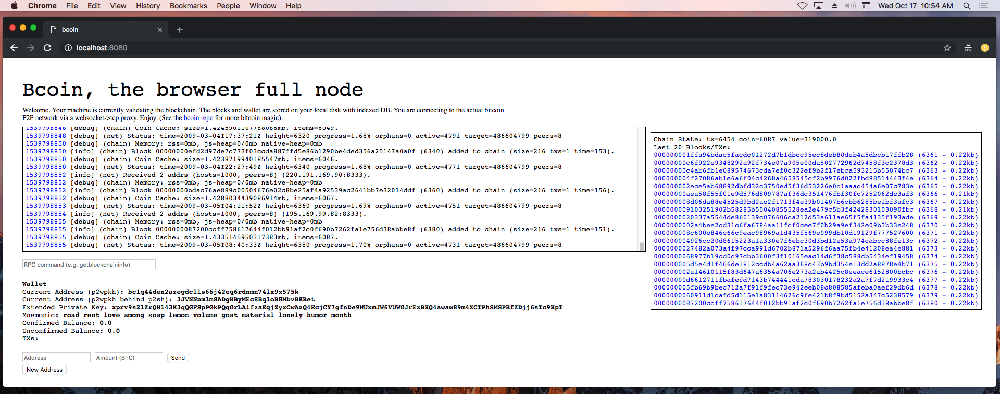

# Run a bcoin full node in a web browser

```post-author
Matthew Zipkin
```

```post-description
The bcoin JavaScript library can be easily formatted to run in a web browser like Chrome.
Using a proxy server, we can connect the web client to the actual live Bitcoin network.
```

## Introduction

Because bcoin is written in JavaScript, the entire codebase can be interpreted by
a standard web browser like Chrome or Firefox. We use `webpack` to compile the library.
This process resolves all the `require()` statements that a NodeJS server can follow
but a browser can not. Webpack is also configured to use `-browser` versions of
some modules for things like databases and cryptography. Finally, it compresses
the code by renaming functions and variables, and removing as much whitespace as possible.
The entire bcoin codebase compresses down to around 1.5 MB!

The second magic trick is connecting the web browser to the actual Bitcoin
peer-to-peer network. [For security reasons, web browsers do not allow scripts
to create TCP connections to any server besides the one they are loaded
from.](https://en.wikipedia.org/wiki/Same-origin_policy)
To get around this, we will need to run a proxy server that makes TCP connections
on behalf of the web client, and forwards all the data through a websocket back
to the browser.

### Step 1: Prepare the code for the browser

First, install bcoin from the GitHub repository like usual:

```command-line
git clone https://github.com/bcoin-org/bcoin
cd bcoin
npm install
```

Next, we'll need to install `webpack` to format the code for the browser:

```command-line
npm install webpack
```

The first time you run webpack, it might prompt you to install `webpack-cli`, enter yes.

<div class="terminal">One CLI for webpack must be installed. These are recommended choices, delivered as separate packages:
 - webpack-cli (https://github.com/webpack/webpack-cli)
   The original webpack full-featured CLI.
We will use "npm" to install the CLI via "npm install -D".
Do you want to install 'webpack-cli' (yes/no):
</div>

<br>

Now use webpack to "browserify" the code. There is already a command for this in
the `package.json` file in the bcoin repository. You may notice that webapck config
files are also stored in the root directory. The config file for this task is `webpack.app.js`.
It will be loaded automatically when you run the command:

```command-line
npm run webpack-app
```

This command creates two new files in the `/browser` directory:
`app.js` and `worker.js`.

`app.js` contains the entire bcoin library plus the basic
functions of the actual web interface. `worker.js` is a script that allows the main
thread to spawn sub-processes to handle some tasks in parallel.

<div class="aside">
  <span> Note:</span>
  `bcoin` and the logging package `blgr` have been recently updated, make sure you have installed
updated versions with these patches merged: [blgr PR#1](https://github.com/bcoin-org/blgr/pull/1),
[bcoin PR#622](https://github.com/bcoin-org/bcoin/pull/622)
</div>

### Step 2: Run the proxy server locally

The `/browser` directory in the bcoin repository contains a `server.js` script which
serves two functions. It serves the browser-compatible bcoin package in a simple
web interface, and it also runs the proxy server `wsproxy.js`.

Start the server with the command:

```command-line
node browser/server.js
```

...then navigate a web browser to [http://localhost:8080](http://localhost:8080)

Did it work?



#### Wow! What is going on?!

The bcoin full node in the browser package has been configured like this:

```javascript
// browser/src/app.js

const ProxySocket = require('./proxysocket');

const node = new FullNode({
  hash: true,
  query: true,
  prune: true,
  network: 'main',
  memory: false,
  coinCache: 30,
  logConsole: true,
  workers: true,
  workerFile: '/worker.js',
  createSocket: (port, host) => {
    const proto = global.location.protocol === 'https:' ? 'wss' : 'ws';
    const hostname = global.location.host;
    return ProxySocket.connect(`${proto}://${hostname}`, port, host);
  },
  logger: logger,
  plugins: [plugin]
});
```

Note especially the `createSocket` option. bcoin was designed with the flexibility
to completely replace the network connectivity method with any arbitrary function.
In this case, we are configuring bcoin to make all TCP connections and data requests
through an object called `ProxySocket`.

`proxysocket.js` runs in the browser and establishes websocket connections with
`wsproxy.js` which runs on the server. All requests for Bitcoin data
(transactions, blocks, SPV filters, peer data, etc.) are routed through this
websocket connection. `wsproxy.js` makes the actual TCP connections to peers on
the live Bitcoin network, and simply forwards the raw data back to the browser.

The full node running in the browser "has no idea" that it's not actually connected
directly to the Bitcoin network.

There is even a text input field for executing RPC commands. Try entering "getinfo"
there and hitting enter. The responding pop-up window can be closed by clicking
anywhere else on the web page.

### Step 3: Run the web and proxy server remotely

So far we are running both server and client on the same machine. If we wanted to
host a bcoin-in-a-browser website like the one at [https://bcoin.io/browser](https://bcoin.io/browser)
we just need to tweak a few parameters in `browser/server.js`. Note the web server
configuration happening here:

```javascript
// browser/server.js

const server = bweb.server({
  port: Number(process.argv[2]) || 8080,
  sockets: false
});
```
It turns out that when we ran the command to start the web server we could also
have added a port argument. If your server only has certain ports open you may
need to add that argument to the command:

```command-line
node browser/server.js 5000
```

In addition, [the default behavior for a `bweb` server](https://github.com/bcoin-org/bweb)
is only to serve locally (on `127.0.0.1` or `localhost`). To open your server to
the internet like we have at [https://bcoin.io/browser](https://bcoin.io/browser),
you need to add a specific `host` option to the configuration like so:

```javascript
// browser/server.js

const server = bweb.server({
  host: '0.0.0.0',
  port: Number(process.argv[2]) || 8080,
  sockets: false
});
```

### Step 4: What's next?

A cryptic note from the mysterious creator of bcoin was left behind in the
original code repository:

<div class="terminal">This is a simple proof-of-concept. It's not a pretty interface. I hope to see
others doing something far more interesting. A browser extension may be better:
the chrome extension API exposes raw TCP access.</div>

<br>

Also be sure to check out [bpanel](https://bpanel.org), the web-based user interface for bcoin. The browser package we just built could be installed into a bpanel plugin -- creating a totally self-contained, extensible, fully validating Bitcoin web applicaiton. 
