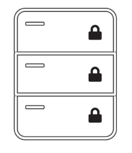
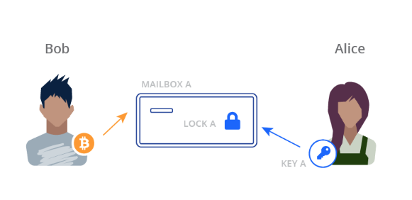
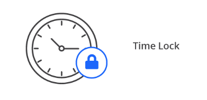
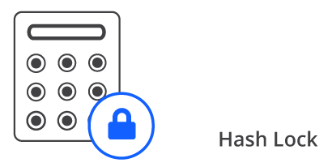
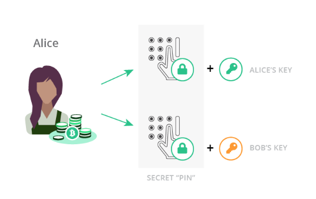
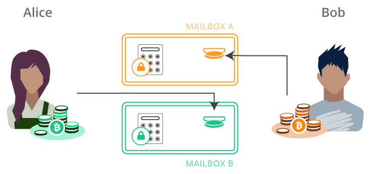
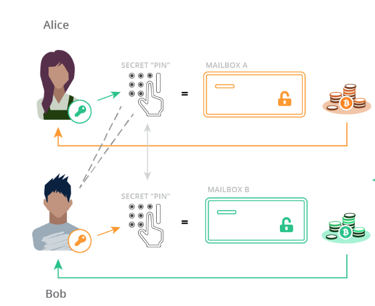
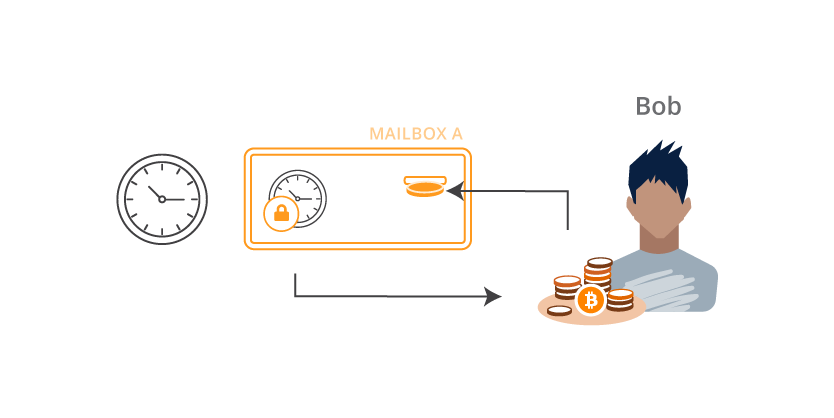

# Cross-Chain Atomic Swaps

```post-author
Matthew Zipkin, graphics by Darren Mills
```

```post-description
Using the bcoin and bcash libraries, execute a swap of coins between two users
on two chains. Create a Hash Time-Locked Contract to perform the swap securely.
```

## What are cross-chain atomic swaps?

A cross-chain atomic swap is method of exchanging different cryptocurrencies directly between two peers.
Like trading dollars for pesos, it's a process in which two people can exchange one cryptocurrency for
another, but without trust or third-party moderation. We say the swaps are "atomic" because they must be
<a href="https://en.wikipedia.org/wiki/Atomicity_(database_systems)">all-or-nothing.</a>
To protect both users, there must be no scenario in which one person can control both coins at the same time.

Atomic swaps can be executed between many blockchains, but not all. For the scheme to work, both
chains need some kind of relative timelock operation (like `OP_CHECKSEQUENCEVERIFY`), as well as the ability
to hash a blob of data and check against a given hash. In this guide we'll
be focusing on just Bitcoin and Bitcoin Cash, using the [bcoin](https://github.com/bcoin-org/bcoin)
and [bcash](https://github.com/bcoin-org/bcash) libraries respectively. It's a bit of
a game: the rules can't be broken, but you still have to pay attention. The magic
machine at the core of the atomic swap is called the Hash Time-Locked Contract, or HTLC.

## HTLCs

<p style="text-align:center"></p>

Blockchains are like a stack of locked mailboxes with deposit slots. When you want to receive Bitcoin
from someone, you tell them which mailbox to put the coin into.

<p style="text-align:center"></p>

Bob decides to pay Alice. He puts 0.5 BTC in the slot of Mailbox “A” which is locked by Lock “A”. When
Alice is ready to spend the coin or move it somewhere else, she uses her Key “A” to open the lock and
take out the coin.

HTLCs are more complicated. First of all, they have TWO locks, and EITHER lock can open the mailbox and
expose the coin. They also use much fancier locks than usual.



### TIME LOCKS

Time locks still require the right key but they ALSO require a certain amount of time to pass. Even if
you have the key for this lock, you still need to wait until the time “expires” before you can open it.

<br>


### HASH LOCKS

Hash locks require the right key but they ALSO require a SECRET CODE to be entered, like the PIN on an ATM.
Even if you have the key for this lock, you also need to enter the right code to open it. When you enter
the secret code, it is visible for the entire world to see, like the screen on a calculator.

## Let's swap!

For now we’ll ignore the time locks, but just keep in mind they are there. In an ideal situation, only
the hash locks are used anyway. As we'll see later on, the time locks are only used as refunds in order
to cancel the swap. Let’s say Alice wants Bitcoin and Bob wants Bitcoin Cash. They agree to
swap the coins they have for the coins they want.

<p style="text-align:center"></p>

Alice makes two hash locks, that both require the EXACT SAME secret code. However, one requires her Key “A”
but the other requires Bob’s Key “B”. Alice knows the secret code but keeps it a secret for now.

<p style="text-align:center"></p>

Alice puts Hash Lock “A” on a Bitcoin mailbox, and Hash Lock “B” on a Bitcoin Cash mailbox. Alice deposits
her Bitcoin Cash into Mailbox “B” and Bob deposits his Bitcoin into Mailbox “A”. 

### MAGIC TIME!

<p style="text-align:center"></p>

Once the coins are both deposited, Alice goes over to Bitcoin Mailbox “A”. She puts in her Key “A” and
enters the secret code she came up with earlier. With the key and the code entered, the mailbox is
opened and she can acquire the Bitcoin. Meanwhile, Bob is watching Bitcoin Mailbox “A” and SEES ALICE ENTER
HER SECRET CODE. Now Bob knows the code too! He goes over to Bitcoin Cash Mailbox “B”, puts in his Key “B”
and enters the secret code he JUST LEARNED from watching Alice. Voila! Bob opens Bitcoin Cash Mailbox “B”
and the coin is his. Alice and Bob have just successfully swapped coins on two separate blockchains without
ever trusting each other or any third-party.

### But what if things don’t go according to plan?

Let’s say Bob put his Bitcoin into Mailbox “A” but then never heard from Alice again. If she doesn’t enter
her secret code, Bob can’t get the Bitcoin Cash he wanted. Bob needs a way to get his original Bitcoin BACK
if Alice doesn’t participate. This is where the time locks come in.

The time locks allow both parties to refund themselves in case the swap does not succeed as planned. The
reason we use time locks for this is to eliminate the possibility that one person ends up with both coins,
leaving the other person with nothing. When the locks are put on the HTLC mailboxes, the time locks are set
to give each counterparty a chance to redeem the swap without interference. If the swap never happens,
everyone can take back the coins they started with after the time expires.

<p style="text-align:center"></p>

The length of time on each lock is important to ensure that the game can only be played fairly. In our story,
Alice’s time lock should be longer (say like a week) and Bob’s lock should be much shorter (like a day).
Broadly speaking this is because Alice knows the hash lock secret and therefore has a major advantage. The
game doesn’t really begin until she reveals her secret code so we make her refund much more cumbersome. If
Bob thinks Alice is going to flake out, he can refund his Bitcoin from Mailbox “A” long before Alice can
refund her Bitcoin Cash from Mailbox “B”. 

To illustrate why this is important, consider if the times were reversed. If Mailbox “B” had the shorter
refund time, Alice could wait until that time expires, refund herself the Bitcoin Cash from Mailbox “B”
AND THEN ALSO enter the secret code into Bitcoin Mailbox “A” and take the Bitcoin that Bob sent.
Alice would have all the money and Bob would be broke!

<a name="scripts"></a>
## Scripts

Now it's time to turn these "two-lock mailboxes" into actual Bitcoin transactions. For this guide we
will describe a very simple method of constructing and executing smart contracts that sacrifice some
privacy and potentially some security. It is not recommended these be used _as is_ in production.
For details on how the implementation can be improved, see [next steps](#next-steps) below.

This will be the redeem script in the output of our Hash Time-Locked Contract:

```bash
OP_IF
  OP_SHA256
  <hash of secret>
  OP_EQUALVERIFY
  <pubKey of swap>
  OP_CHECKSIG
OP_ELSE
  <relative locktime>
  OP_CHECKSEQUENCEVERIFY
  OP_DROP
  <pubKey of refund>
  OP_CHECKSIG
OP_ENDIF
```

The Hash Lock is the first section of the script, executed when `OP_IF` reads a `true` value from the stack.
It expects a secret value and an ECDSA signature. It hashes the secret and checks that it matches a given hash,
then it checks the signature against the given public key. To redeem the HTLC this way, we will use the following
script in the input of a transaction:

```bash
<signature of swap>
<secret value>
<true>
```

Keep in mind that the stack is <a href="https://en.wikipedia.org/wiki/Stack_(abstract_data_type)">first-in / last-out</a>,
so if this input script looks "upside-down" that's because the last element will end up being on the top of the
stack when the redeem script is run.

The time lock is executed when `OP_IF` gets a `false` value. This causes script execution to skip all OP codes
until it finds `OP_ELSE`, where it continues processing up to `OP_ENDIF`. The time lock will only be checked when `if (false)`.

First it executes a [Check Sequence Verify](https://github.com/bitcoinbook/bitcoinbook/blob/develop/ch07.asciidoc#relative-timelocks)
routine, which fails if the given relative locktime has not yet passed. Then it simply checks a signature
against a given public key like usual. To redeem the transaction with this path, we will use this input script:

```bash
<signature of refund>
<false>
```

## Creating HTLC scripts with bcoin and bcash

The `bcoin` and `bcash` libraries are so similar that we can use the exact same commands
to create HTLCs on both chains, and build a working application with wallets. A finished package
can be found at [https://github.com/pinheadmz/swap-test](https://github.com/pinheadmz/swap-test). First, we'll
review the `Swap` class in `lib/swap.js` that is able to build scripts, addresses, and transactions
on any compatible library passed to it. With almost no conditionals, we can make this library completely
chain-agnostic.

```javascript
// lib/swap.js

class Swap {
  constructor(lib, network){
    // Require the library by name and set the network for every module
    this.libName = lib;
    this.lib = require(lib);
    this.lib.Network.set(network);

    // Import each module we'll need from the library
    this.Outpoint = this.lib.Outpoint;
    this.Coin = this.lib.Coin;
    this.MTX = this.lib.MTX;
    this.TX = this.lib.TX;
    this.Address = this.lib.Address;
    this.hd = this.lib.hd;
    this.KeyRing = this.lib.KeyRing;
    this.Script = this.lib.Script;
    this.Stack = this.lib.Stack;
    this.consensus = this.lib.consensus;
    this.util = this.lib.util;
    this.ChainEntry = this.lib.ChainEntry;

    // Verify things like SegWit, CSV, Bitcoin Cash FORKID, etc.
    this.flags = this.Script.flags.STANDARD_VERIFY_FLAGS;
    
    // We will base our relative locktime on TIME, not BLOCKS
    this.CSV_seconds = true;
  }
```

For example, observe how creating a new object with `new Swap('bcoin', 'testnet')` would
give us the specific `Address` module for making Bitcoin addresses. We could create a second object for
`bcash` that would, with the exact same line of code, give us the module for Bitcoin Cash addresses.

_SWEET._

The next three functions we'll need will compile our Bitcoin scripts from the last section into
the actual byte code used in serialized transactions on the network. To learn more about working with scripts,
check out the bcoin.io guides [Intro to Scripting](scripting.html) and the more advanced
[Time Locked Bitcoin Transactions w/ CLTV](cltv.html).

```javascript
// lib/swap.js

class Swap {
  ...

  // REDEEM script: the output of the swap HTLC
  getRedeemScript(hash, refundPubkey, swapPubkey, locktime){
    const redeem = new this.Script();

    redeem.pushSym('OP_IF');
    redeem.pushSym('OP_SHA256');
    redeem.pushData(hash);
    redeem.pushSym('OP_EQUALVERIFY');
    redeem.pushData(swapPubkey);
    redeem.pushSym('OP_CHECKSIG');
    redeem.pushSym('OP_ELSE');
    redeem.pushInt(locktime);
    redeem.pushSym('OP_CHECKSEQUENCEVERIFY');
    redeem.pushSym('OP_DROP');
    redeem.pushData(refundPubkey);
    redeem.pushSym('OP_CHECKSIG');
    redeem.pushSym('OP_ENDIF');
    redeem.compile();

    return redeem;
  }

  // SWAP script: used by counterparty to open the hash lock 
  getSwapInputScript(redeemScript, secret){
    const inputSwap = new this.Script();

    inputSwap.pushInt(0); // signature placeholder
    inputSwap.pushData(secret);
    inputSwap.pushInt(1); // <true>
    inputSwap.pushData(redeemScript.toRaw()); // P2SH
    inputSwap.compile();

    return inputSwap;
  }

  // REFUND script: used by original sender of funds to open time lock
  getRefundInputScript(redeemScript){
    const inputRefund = new this.Script();

    inputRefund.pushInt(0); // signature placeholder
    inputRefund.pushInt(0); // <false>
    inputRefund.pushData(redeemScript.toRaw()); // P2SH
    inputRefund.compile();

    return inputRefund;
  }
}
```

You might notice there are two extra lines marked with `// P2SH` that you didn't see in the input scripts
section above. This is required by the mechanics of Pay-To-Script-Hash transactions. The transaction output
we are spending from contains only a hash of the redeem script. The actual redeem script itself is provided
by the input scripts at the time the coin is being spent, so they are included here.

The lines marked `// signature placeholder` are required before the transaction is signed. The laws of the finite
universe prevent us from signing a message that already contains its own signature, and the
[Bitcoin Protocol](https://en.bitcoin.it/wiki/OP_CHECKSIG) therefore expects the signatures to be removed
from a transaction script during verification. Eventually we will sign our transactions with these `Int(0)`'s
in the scripts, then replace them with the final signatures for broadcasting to the network.

## Funding the swap

This is an easy process. We have our HTLC redeem script ready to go, we just need to turn that into
a P2SH address, and send some coins! This is where the similarity between libraries is crucial. For
both networks, we can generate valid P2SH addresses using the same function:

```javascript
// lib/swap.js

class Swap {
  ...

  getAddressFromRedeemScript(redeemScript){
    // P2SH wrapper around 160-bit hash of serialized redeem script
    return this.Address.fromScripthash(redeemScript.hash160());
  }
}
```

On testnet, using two different instances of our `Swap` class, this function will give us the
following example addresses:

<div class="terminal">2NDeKm7Yu3Z4HoRn7qVkead8trTKG8y3RQE # Bitcoin
bchtest:pppj5wmjdqj6mxc8yfz2vfsrzdvqpsjctu0pu5wus3 # Bitcoin Cash</div>

## Redeeming the swap

Once funds are sent to the P2SH addresses, we can spend them using either the `swap` or
`refund` input scripts. We have already generated the scripts so we just need to create a transaction
and sign it! Generating the signatures is handled entirely by the `TX` module in each library:

```javascript
// lib/swap.js

class Swap {
  ...

  signInput(
    mtx,
    index,
    redeemScript,
    value,
    privateKey,
    sigHashType,
    version_or_flags
  ) {

    return mtx.signature(
      index,
      redeemScript,
      value,
      privateKey,
      sigHashType,
      version_or_flags
    );
  }
}
```

Uhh... what the heck is `version_or_flags`? Ok, here we finally have some divergence between
`bcoin` and `bcash`. In the `tx.signature()` function, `bcoin` expects a `version` integer to select either
legacy or [SegWit serialization](https://github.com/bitcoin/bips/blob/master/bip-0143.mediawiki#specification)
for signing. Since Bitcoin Cash does not have any SegWit features at all, this parameter is instead used
to pass additional SigHash flags used for
[replay protection at the time of the hard fork.](https://github.com/Bitcoin-ABC/bitcoin-abc/blob/master/doc/abc/replay-protected-sighash.md)

Due to a similar inconsistency, we will need to pass different values for `sigHashType` depending on 
which chain we are constructing transactions for. With those disclaimers behind us, let's build the transaction!
The following function puts together all the pieces to complete the swap. For more detail on how these `MTX`
methods work, see the bcoin.io guide [Working with transactions](working-with-txs.html).

```javascript
// lib/swap.js

class Swap {
  ...

  // Works for both refund and swap
  getRedeemTX(
    address,
    fee,
    fundingTX,
    fundingTXoutput,
    redeemScript,
    inputScript,
    locktime,
    privateKey
  ){

    // Create a mutable transaction object
    const redeemTX = new this.MTX();

    // Get the output we want to spend (coins sent to the P2SH address) 
    const coin = this.Coin.fromTX(fundingTX, fundingTXoutput, -1);

    // Add that coin as an input to our transaction
    redeemTX.addCoin(coin);

    // Redeem the input coin with either the swap or refund script
    redeemTX.inputs[0].script = inputScript;

    // Create the output back to our primary wallet
    redeemTX.addOutput({
      address: address,
      value: coin.value - fee
    });

    // If this was a refund redemption we need to set the sequence
    // Sequence is the relative timelock value applied to individual inputs
    if (locktime)
      redeemTX.setSequence(0, locktime, this.CSV_seconds);
    else
      redeemTX.inputs[0].sequence = 0xffffffff;

    // Set SIGHASH and replay protection bits
    let version_or_flags = 0;
    let type = null;
    if (this.libName === 'bcash') {
      version_or_flags = this.flags;
      type = this.Script.hashType.SIGHASH_FORKID | this.Script.hashType.ALL; 
    }

    // Create the signature authorizing the input script to spend the coin
    const sig = this.signInput(
      redeemTX,
      0,
      redeemScript,
      coin.value,
      privateKey,
      type,
      version_or_flags
    );

    // Insert the signature into the input script where we had a `0` placeholder
    inputScript.setData(0, sig);

    // Finish up and return
    inputScript.compile();
    return redeemTX;
  }
}
```

Once we've completed and signed the transaction, we can test that it verifies
against the network rules:

```javascript
// lib/swap.js

class Swap {
  ...
    
  verifyMTX(mtx){
    return mtx.verify(this.flags)
  }
}
```

## Agreeing on and executing a swap

Now that we have all the tools, you might be asking yourself ["What is the minimum amount of information
two parties need to send each other to engage in a swap?"](https://youtu.be/i7wnagAyqvc?t=2507) This is where
some additional crypto-magic comes in to play. It turns out that besides the exchange rate and volume, the only thing the two trading partners need to exchange is:

1. One ECDSA public key from each party
2. A hashed secret from one party

Using these data and the scripting functions from the last section, both parties can deterministically derive
the P2SH addresses for the contracts on both chains. By watching for transactions in and out of those addresses
on both chains, everyone will have everything they need to play the atomic swap game.

We can add two simple functions to generate these data, using the [bcrypto](https://github.com/bcoin-org/bcrypto) module as a utility:

```javascript
// lib/swap.js

class Swap {
  ...

  // Generate a random secret and derive its SHA-256 hash
  getSecret() {
    secret = bcrypto.random.randomBytes(32);
    const hash = bcrypto.SHA256.digest(secret);

    return {
      'secret': secret,
      'hash': hash
    }
  }

  // Generate an ECDSA public / private key pair
  getKeyPair(){
    // Generate new random private key
    const master = this.hd.generate();
    const key = master.derivePath('m/44/0/0/0/0');
    privateKey = key.privateKey;

    // Derive public key from private key
    const keyring = this.KeyRing.fromPrivate(privateKey);
    const publicKey = keyring.publicKey;

    return {
      'publicKey': publicKey,
      'privateKey': privateKey,
    }
  }
}
```

They key exchange method is up to the users on the application layer. They could save a little space
by agreeing on a protocol in advance. We can imagine preset, hard-coded locktimes and perhaps
a common exchange rate API. In my demonstration repository, I have a script `app/prep-swap.js` that imports
the [bstring](https://github.com/bcoin-org/bstring) module and encodes the keys into base58
strings which Alice and Bob can send each other:

```javascript
// app/prep-swap.js

/*
 * Create parameters for swap
 */

const {base58} = require('bstring');
const Swap = require('../lib/swap');

const swap = new Swap('bcoin', 'testnet');  // could be any library for this step
const secret = swap.getSecret();
const keys = swap.getKeyPair();

const pub = {
  hash: secret.hash.toString('hex'),
  publicKey: keys.publicKey.toString('hex')
};
const priv = {
  secret: secret.secret.toString('hex'),
  privateKey: keys.privateKey.toString('hex'),
};

const pubBase58 = base58.encode(new Buffer(JSON.stringify(pub)));
const privBase58 = base58.encode(new Buffer(JSON.stringify(priv)));

console.log('\n --- \n');
console.log('PUBLIC: send to counterparty:\n', pubBase58);
console.log('\n --- \n');
console.log('PRIVATE: keep safe and pass to run script:\n', privBase58);
console.log('\n --- \n');
```

Running the script above with the command `node app/prep-swap.js` returns output like this:

<div class="terminal" style="word"> --- 

PUBLIC: send to counterparty:
 aBH1zNWHWMbrDca59P4stUUw4XfW3vv25AidWFnfjLh4icanECVq4FAZRtQutddZr6VEM5a5KQtp93
 EA3jvZ3o5ViPXTW8E1kKDaZiZPxUxp8rxmg8mnqNW2s7qh5JasyrYnTAyensNQhAAUP4cwhyHRYvmV
 mhbMqRLU9DTi1nKdMGfpBu7MfjNGnpBZ2WdiSQiiopQgwXQaTBKYhS7Fr

 --- 

PRIVATE: keep safe and pass to run script:
 3XSNNNHE27JLQFY9FAKHDra2u1RUocFGgw1fAxrNJw3gmXqZdPLBpbpqZ8nWNw2stCS7DuGCuPqLPq
 M3ivxQhRJkSDa2PukPxAcHKV6HNZK1jQx57EKF523KqSLgNuKMEYF7U1YrPYe5CKMX2wgLDL2W763G
 ikdcJtzKsKH8KnuKSVSy3FVBsLtixPFKsfgrEvhQ9QsqgHzJz3MomLNdrkC

 --- </div>

## Using the blockchain to communicate

Remember, part of the swap protocol involves Alice revealing her secret value to Bob. That is
done on the blockchain, so Bob needs to watch the chain for Alice's redemption transaction
and pull the secret value out of it somehow. Since we know the exact structure of Alice's
[input script](#scripts) we can expect her secret to be the second value in the script.
Once we catch Alice's transaction we need to figure out which input is redeeming the swap,
then grab the secret. We discover the input by looking for the P2SH address we derived earlier.

```javascript
// lib/swap.js

class Swap {
  ...

  extractSecret(tx, address){
    // Find the input that spends from the P2SH address
    for (const input of tx.inputs){
      const inputJSON = input.getJSON();
      const inAddr = inputJSON.address;
      // Once we find it, return the second script item (the secret)
      if (inAddr === address)
        return input.script.code[1].data;
    }
    return false;
  }
}
```

## Watch-only wallets and events

The last mechanism we need to make a functional atomic swap application is a wallet, or
several wallets. Refer to the bcoin.io guide [Events and Sockets](events.html)
for more background on events and "joining wallets" with websockets. 

To run an atomic swap with bcoin and bcash, an application will run four servers:

* bcoin node
* bcoin wallet
* bcash node
* bcash wallet

You can see my design in `app/run-swap.js` in the 
[completed repository](https://github.com/pinheadmz/swap-test). Notice the 
[configuration](https://github.com/pinheadmz/swap-test#configuration) section of the README
which lists the port numbers for each server.

For brevity, we'll just review the last step in our swap story: Bob extracting the HTLC
secret from Alice's Bitcoin Cash sweep-transaction and using it to sweep his own Bitcoin
transaction. Keep in mind that by the time the following code is run, Bob has already deposited
BTC into the swap address for Alice to sweep. The code is presented linearly here but in
the actual application it is organized a bit differently.

We assume the application has already constructed `BTC_Swap` and `BCH_Swap` objects,
as well as `BTC_WalletClient`, `BCH_WalletClient`, `BTC_NodeClient` and `BCH_NodeClient`.

```javascript
// app/run-swap.js

// Derive the redeem script
const BTC_RedeemScript = Swap.getRedeemScript(
  hash,
  publicKey_Alice,
  publicKey_Bob,
  timelock
);

// Derive P2SH address from the script
const BTC_AddrFromScript = BTC_Swap.getAddressFromRedeemScript(BTC_RedeemScript);
const BTC_P2SH_Address = BTC_AddrFromScript.toString('testnet');

// Create a watch-only wallet to catch Alice's BTC sweep and get its details
BTC_WalletInfo = await BTC_WalletClient.createWallet('SwapWithAlice', {watchOnly: true});

// Get the wallet we just created
const BTC_Wallet = BTC_WalletClient.wallet('SwapWithAlice');

// Import the watch-only address into the wallet's default account
await BTC_Wallet.importAddress('default', BTC_P2SH_Address);

// Listen for events by "joining" the wallet with it's API token
await BTC_WalletClient.join('SwapWithAlice', BTC_WalletInfo.token);

// Establish the entire swap-seep procedure and bind it to the watch-only wallet
BTC_Wallet.bind('confirmed', async (wallet, txDetails) => {

    // Get details from Alice's TX, emitted by the event
    const fundingTX = BTC_Swap.TX.fromRaw(txDetails.tx, 'hex');

    // Extract the HTLC secret value
    const revealedSecret = BTC_Swap.extractSecret(
      fundingTX,
      BTC_P2SH_Address
    );

   /*  Create a TX on the BITCOIN CASH chain to sweep Alice's BCH output.
     *  We assume `BCH_RedeemScript` has already been derived and we have verified
     *  that Alice has sent the right amount of BCH to that P2SH address.
     *  Alice's BCH funding TX is stored as `Alices_BCH_FundingTX`, and
     *  the output that concerns Bob is `Alices_BCH_FundingTX_OutputIndex`.
     */

    // Derive the input script to redeem the BCH transaction
    const BCH_SwapScript = BCH_Swap.getSwapInputScript(
      BCH_RedeemScript,
      revealedSecret
    );

    // Build a BCH transaction to spend Alice's output
    const swapTX = BCH_Swap.getRedeemTX(
      Bobs_BCH_WalletAddress,
      feeRate,
      Alices_BCH_FundingTX,
      Alices_BCH_FundingTX_OutputIndex,
      BCH_RedeemScript,
      BCH_SwapScript,
      null,
      Bobs_PrivateKey
    );

    // Finalize and serialize the TX for broadcast
    const finalTX = swapTX.toTX();
    const stringTX = finalTX.toRaw().toString('hex');

    // Broadcast BCH swap-sweep TX, and we're done!
    const broadcastResult = await BCH_NodeClient.broadcast(stringTX);
});
```

Alice will have similar code running on her end. When she broadcasts her BTC sweep
transaction, Bob's code will automatically catch it, derive the HTLC secret, and
sweep the BCH transaction.

<iframe width="560" height="315" src="https://www.youtube-nocookie.com/embed/utOAL2Uw_Mk?rel=1" frameborder="0" allow="accelerometer; autoplay; encrypted-media; gyroscope; picture-in-picture" allowfullscreen></iframe>

<a name="next-steps"></a>
## Next steps

We've built a very simple atomic swaps application! But what have we sacrificed for convenience?

* To improve privacy, we might want to use separate public keys for each blockchain, instead of using
the same key on both networks (although it is very cool and convenient that public keys can be re-used
on these two networks).

* We have been using raw public keys, but most of the time in Bitcoin we exchange hashed (RIPE-160)
public keys. In our case, this hash would require a few extra OP codes in the redeem script.

* We should also check all the amounts being transacted and return an error if the counterparty didn't
send the right amount.

* The watch-only wallets work great, but what if Bob creates his watch-only wallet AFTER Alice sends
her first transaction? How will Bob ever know? The app should be able to rescan recent blockchain
history to make sure it hasn't missed anything on launch.

* CSV encoding. We built our app using timelocks based in seconds, not blocks.
BIP 68 describes a specific bit-by-bit encoding scheme that must be used to create a valid timelock value.
Look for the function `CSVencode()` in `lib/swap.js`

* User interface: all this command line copying/pasting is not a great user experience. A better
UI or [bpanel plugin](https://bpanel.org/docs/plugin-started.html) would make the application much easier to use.

If you have any ideas or suggestions please feel free to post an issue or pull request
in the proof-of-concept repo! [https://github.com/pinheadmz/swap-test](https://github.com/pinheadmz/swap-test)

**HAPPY SWAPPING!**


## References

[On-chain atomic swaps for Decred and other cryptocurrencies.](https://github.com/decred/atomicswap)

[Mastering Bitcoin: Hash Time Lock Contracts (HTLC)](https://github.com/bitcoinbook/bitcoinbook/blob/develop/ch12.asciidoc#hash-time-lock-contracts-htlc)

[SF Cryptocurrency Dev: James Prestwich's Summa: Atomic, Cross-chain Contracts](https://www.youtube.com/watch?v=i7wnagAyqvc)

[BIP 68: Relative lock-time using consensus-enforced sequence numbers](https://github.com/bitcoin/bips/blob/master/bip-0068.mediawiki)

[BIP 16: Pay to Script Hash](https://github.com/bitcoin/bips/blob/master/bip-0016.mediawiki)

## Related reading

[Intro to Scripting](scripting.html)

[Time Locked Bitcoin Transactions w/ CLTV](cltv.html)

[Working with transactions](working-with-txs.html)

[Events and Sockets](events.html)
