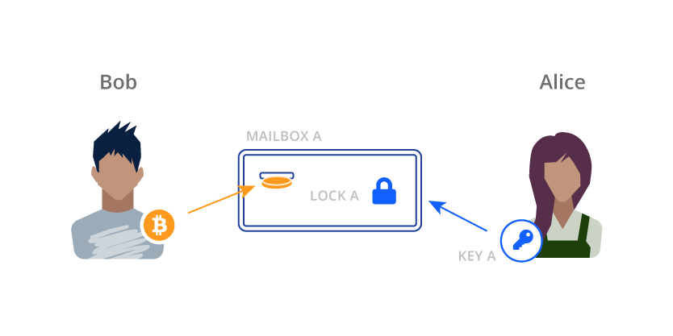
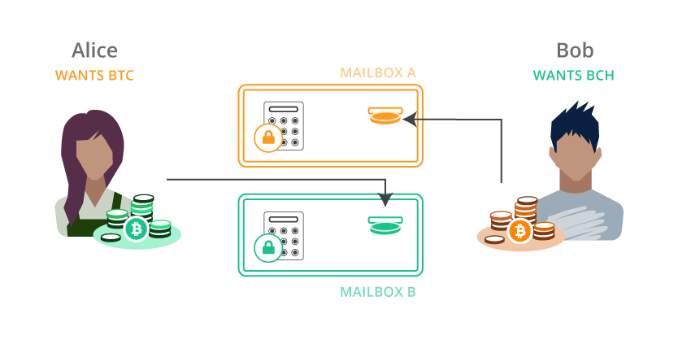

<style>
  .btc {color: #ff9900; background-color:gray;}
  .bch {color: #8dc351; background-color:Zgray}
</style>
# Cross-Chain Atomic Swaps

```post-author
Matthew Zipkin
```

```post-description
Using the bcoin and bcash libraries, execute a swap of coins between two users
on two chains. Create a Hash Time-Locked Contract to perform the swap securely.
```

## What are cross-chain atomic swaps?

A cross-chain atomic swap is a type of crypto-currency exchange. Like trading dollars for pesos,
it's a process in which two people can exchange one crypto-currency for another, but trust or third-party
moderation. We say the swaps are "atomic" because they must be [all-or-nothing.](https://en.wikipedia.org/wiki/Atomicity_(database_systems))
To protect both users, there must be no scenario in which one person can control both coins at the same time.

Atomic swaps can be executed on many blockchains, but not all. In this guide we'll
be focusing on just Bitcoin and Bitcoin Cash, using the [bcoin](https://github.com/bcoin-org/bcoin)
and [bcash](https://github.com/bcoin-org/bcash) libraries respectively. It's a bit of
a game: the rules can't be broken, but you still have to pay attention. The magic
machine that allows the atomic swap is called the Hash Time-Locked Contract, or HTLC.

## HTLCs


Blockchains are like a stack of locked mailboxes with deposit slots. When you want to receive Bitcoin
from someone, you tell them which mailbox to put the coin into.



Bob decides to pay Alice. He puts 0.5 BTC in the slot of Mailbox “A” which is locked by Lock “A”. When
Alice is ready to spend the coin or move it somewhere else, she uses her Key “A” to open the lock and
take out the coin.

HTLCs are more complicated. First of all, they have TWO locks, and EITHER lock can open the mailbox and
expose the coin. They also use much fancier locks than usual.


### TIME LOCKS

Time locks still require the right key but they ALSO require a certain amount of time to pass. Even if
you have the key for this lock, you still need to wait until the time “expires” before you can open it.

### HASH LOCKS

Hash locks require the right key but they ALSO require a SECRET CODE to be entered, like the PIN on an ATM.
Even if you have the key for this lock, you also need to enter the right code to open it. When you enter
the secret code, it is visible for the entire world to see, like the screen on a calculator.

## Let's swap!

For now we’ll ignore the time locks, but just keep in mind they are there. In an ideal situation, only
the hash locks are used anyway. Let’s say Alice wants Bitcoin and Bob wants Bitcoin Cash. They agree to
swap the coins they have for the coins they want.


Alice makes two hash locks, that both require the EXACT SAME secret code. However, one requires her Key “A”
but the other requires Bob’s Key “B”. Alice knows the secret code but keeps it a secret for now.



Alice puts Hash Lock “A” on a Bitcoin mailbox, and Hash Lock “B” on a Bitcoin Cash mailbox. Alice deposits
her Bitcoin Cash into Mailbox “B” and Bob deposits his Bitcoin into Mailbox “A”. 

### MAGIC TIME!


Once the coins are both deposited, Alice goes over to Bitcoin Mailbox “A”. She puts in her Key “A” and
enters the secret code she came up with earlier. With the key and the code entered, the mailbox is
opened and she can acquire the Bitcoin. Meanwhile, Bob is watching Bitcoin Mailbox “A” and SEES ALICE ENTER
HER SECRET CODE. Now Bob knows the code too! He goes over to Bitcoin Cash Mailbox “B”, puts in his Key “B”
and enters the secret code he JUST LEARNED from watching Alice. Voila! Bob opens Bitcoin Cash Mailbox “B”
and the coin is his. Alice and Bob have just successfully swapped coins on two separate blockchains without
ever trusting each other or any third-party.

### But what if things don’t go according to plan?

Let’s say Bob put his Bitcoin into Mailbox “A” but then never heard from Alice again. If she doesn’t enter
her secret code, Bob can’t get the Bitcoin Cash he wanted. Bob needs a way to get his original Bitcoin BACK
if Alice doesn’t participate. This is where the time locks come in.

The time locks allow both parties to refund themselves in case the swap does not succeed as planned. The
reason we use time locks for this is to eliminate the possibility that one person ends up with both coins,
leaving the other person with nothing. When the locks are put on the HTLC mailboxes, the time locks are set
to give each counterparty a chance to redeem the swap without interference. If the swap never happens,
everyone can take back the coins they started with after the time expires.


The length of time on each lock is important to ensure that the game can only be played fairly. In our story,
Alice’s time lock should be longer (say like a week) and Bob’s lock should be much shorter (like a day).
Broadly speaking this is because Alice knows the hash lock secret and therefore has a major advantage. The
game doesn’t really begin until she reveals her secret code so we make her refund much more cumbersome. If
Bob thinks Alice is going to flake out, he can refund his Bitcoin from Mailbox “A” long before Alice can
refund her Bitcoin Cash from Mailbox “B”. 

Think about the counter-example. If Mailbox “B” had the shorter refund time, Alice could wait until that time
expires, refund herself the Bitcoin Cash from Mailbox “B” AND THEN ALSO enter the secret code into Bitcoin
Mailbox “A” and take the Bitcoin that Bob sent. Alice would have all the money and Bob would be broke!

## Scripts

Now it's time to turn these "two-lock mailboxes" into actual Bitcoin transactions. For this guide we
will describe a very simple method that sacrafices some privacy and potentially some security. See
[next steps](#next-steps) for more details on this.
This will be the redeem script in the output of our Hash Time-Locked Contract:

```bash
OP_IF
  OP_SHA256
  <hash of secret>
  OP_EQUALVERIFY
  <pubKey to swap>
  OP_CHECKSIG
OP_ELSE
  <relative locktime>
  OP_CHECKSEQUENCEVERIFY
  OP_DROP
  <pubKey to refund>
  OP_CHECKSIG
OP_ENDIF
```

The Hash Lock is the first section of the script, executed when `OP_IF` reads a `true` value from the stack.
It expects a secret value and an ECDSA signature. It hashes the secret and checks that it matches a given hash,
then it checks the signature against the given public key. To redeem the HTLC this way, we will use the following
script in the input of a transaction:

```bash
<signature to swap>
<secret value>
<true>
```

Keep in mind that the stack is first-in / last-out, so if this input script looks "upside-down" that's because the
last element will end up being on the top of the stack when the redeem script is run.

The Time Lock is executed when `OP_IF` gets a `false` value. First it executes a
[Check Sequence Verify](https://github.com/bitcoinbook/bitcoinbook/blob/develop/ch07.asciidoc#relative-timelocks)
routine, which fails if the given relative locktime has not yet passed. Then it simply checks a signature
against a given public key like usual. To redeem the transaction with this path, we will use this input script:

```bash
<signature to refund>
<false>
```

## bcoin and bcash

The `bcoin` and `bcash` libraries are so similar that we can use the exact same commands
to create HTLCs on both chains, and build a working application with wallets. A finished package
can be found at [https://github.com/pinheadmz/swap-test](https://github.com/pinheadmz/swap-test). First, we'll
review the `Swap` class in `lib/swap.js` that is able to build scripts, addresses, and transactions
on any compatible library passed to it. With almost no conditionals, we can make this library completely
chain-agnostic.

```javascript
// lib/swap.js

class Swap {
  constructor(lib, network){
    this.libName = lib;
    this.lib = require(lib);
    this.lib.Network.set(network);

    this.Outpoint = this.lib.Outpoint;
    this.Coin = this.lib.Coin;
    this.MTX = this.lib.MTX;
    this.TX = this.lib.TX;
    this.Address = this.lib.Address;
    this.hd = this.lib.hd;
    this.KeyRing = this.lib.KeyRing;
    this.Script = this.lib.Script;
    this.Stack = this.lib.Stack;
    this.consensus = this.lib.consensus;
    this.util = this.lib.util;
    this.ChainEntry = this.lib.ChainEntry;

    this.flags = this.Script.flags.STANDARD_VERIFY_FLAGS;
    this.CSV_seconds = true;
  }
```

For example, observe how creating a new object with `new Swap('bcoin', 'testnet')` would
give us the specific `Address` module for making Bitcoin addresses. We could create a second object for
`bcash` that would, with the exact same line of code, give us the module for Bitcoin Cash addresses.

_SWEET._

The next three functions we'll need will compile our Bitcoin scripts from the last section into
the actual byte code used in serialized transactions on the network. For more background on this,
check out the bcoin.io guides [Intro to Scripting](scripting.html) and the more advanced
[Time Locked Bitcoin Transactions w/ CLTV](cltv.html).

```javascript
// lib/swap.js
// Class Swap {}...

getRedeemScript(hash, refundPubkey, swapPubkey, locktime){
  const redeem = new this.Script();

  redeem.pushSym('OP_IF');
  redeem.pushSym('OP_SHA256');
  redeem.pushData(hash);
  redeem.pushSym('OP_EQUALVERIFY');
  redeem.pushData(swapPubkey);
  redeem.pushSym('OP_CHECKSIG');
  redeem.pushSym('OP_ELSE');
  redeem.pushInt(locktime);
  redeem.pushSym('OP_CHECKSEQUENCEVERIFY');
  redeem.pushSym('OP_DROP');
  redeem.pushData(refundPubkey);
  redeem.pushSym('OP_CHECKSIG');
  redeem.pushSym('OP_ENDIF');
  redeem.compile();

  return redeem;
}

getSwapInputScript(redeemScript, secret){
  const inputSwap = new this.Script();

  inputSwap.pushInt(0); // signature placeholder
  inputSwap.pushData(secret);
  inputSwap.pushInt(1); // <true>
  inputSwap.pushData(redeemScript.toRaw()); // P2SH
  inputSwap.compile();

  return inputSwap;
}

getRefundInputScript(redeemScript){
  const inputRefund = new this.Script();

  inputRefund.pushInt(0); // signature placeholder
  inputRefund.pushInt(0); // <false>
  inputRefund.pushData(redeemScript.toRaw()); // P2SH
  inputRefund.compile();

  return inputRefund;
}
```

You might notice there are two extra lines marked with `// P2SH` that you didn't see in the input scripts
section above. This is required by the mechanics of Pay-To-Script-Hash transactions. The transaction output
we are spending from contains only a hash of the redeem script. The actual redeem script itself is provided
by the input scripts at the time the coin is being spent, so they are included here.

The lines marked `// signature placeholder` are required before the transaction is signed. The laws of the finite
universe prevent us from signing a message that already contains its own signature, and the
[Bitcoin Protocol](https://en.bitcoin.it/wiki/OP_CHECKSIG) therefore expects the signatures to be removed
from a transaction script during verification. Eventually we will sign our transactions with these `Int(0)`'s
in the scripts, then replace them with the final signatures for broadcasting to the network.

## Funding the swap

This is an easy process. We have our HTLC redeem script ready to go, we just need to turn that into
a P2SH address, and send some coins! This is where the similarity between libraries is crucial. For
both networks, we can generate valid P2SH addresses using the same function:

```javascript
// lib/swap.js
// Class Swap {}...

getAddressFromRedeemScript(redeemScript){
  return this.Address.fromScripthash(redeemScript.hash160());
}
```

On testnet, using two different instances of our `Swap` class, this function will give us the
following example addresses:

<div class="terminal">2NDeKm7Yu3Z4HoRn7qVkead8trTKG8y3RQE # Bitcoin
bchtest:pppj5wmjdqj6mxc8yfz2vfsrzdvqpsjctu0pu5wus3 # Bitcoin Cash</div>

## Redeeming the swap

Once funds are sent to the P2SH addresses, we can spend them using either the `swap` or
`refund` input scripts. We have already generated the scripts so we just need to create a transaction
and sign it! Generating the signatures is handled entirely by the `tx.js` module in each library:

```javascript
// lib/swap.js
// Class Swap {}...

signInput(
  mtx,
  index,
  redeemScript,
  value,
  privateKey,
  sigHashType,
  version_or_flags
) {

  return mtx.signature(
    index,
    redeemScript,
    value,
    privateKey,
    sigHashType,
    version_or_flags
  );
}
```

Uhh... what the heck is `version_or_flags`? Ok, here we finally have some divergence between
`bcoin` and `bcash`. In the `tx.signature()` function, `bcoin` expects a `version` integer to select either
legacy or [SegWit serialization](https://github.com/bitcoin/bips/blob/master/bip-0143.mediawiki#specification)
for signing. Since Bitcoin Cash does not have any SegWit features at all, this parameter is instead used
to pass additional SigHash flags used for replay protection at the time of the hard fork.

Due to a similar inconsistency, we will need to pass different values for `type` depending on 
which chain we are constructing transactions for. With those disclaimers behind us, let's build the transaction!

```javascript
// lib/swap.js
// Class Swap {}...

// works for both refund and swap
getRedeemTX(
  address,
  fee,
  fundingTX,
  fundingTXoutput,
  redeemScript,
  inputScript,
  locktime,
  privateKey
){
  const redeemTX = new this.MTX();
  const coin = this.Coin.fromTX(fundingTX, fundingTXoutput, -1);

  redeemTX.addOutput({
    address: address,
    value: coin.value - fee
  });
  redeemTX.addCoin(coin);
  redeemTX.inputs[0].script = inputScript;
  if (locktime)
    redeemTX.setSequence(0, locktime, this.CSV_seconds);
  else
    redeemTX.inputs[0].sequence = 0xffffffff;

  let version_or_flags = 0;
  let type = null;
  if (this.libName === 'bcash') {
    version_or_flags = this.flags;
    type = this.Script.hashType.SIGHASH_FORKID | this.Script.hashType.ALL; 
  }

  const sig = this.signInput(
    redeemTX,
    0,
    redeemScript,
    coin.value,
    privateKey,
    type,
    version_or_flags
  );

  inputScript.setData(0, sig);
  inputScript.compile();

  return redeemTX;
}
```


## Agreeing on and executing a swap

Now that we have all the tools, you might be asking yourself ["What is the minimum amount of information
two parties need to send each other to engage in a swap?"](https://youtu.be/i7wnagAyqvc?t=2507) This where
some additional crypto-magic comes in to play. It turns out that besides the exchange rate and locktimes, the only thing
the two trading partners need to exchange is:

1. One ECDSA public key from each party
2. A hashed secret from one party

Using these data and the scripting functions from the last section, both parties can deterministically derive
the P2SH addresses for this contract on both chains. By watching for transactions in and out of those addresses
on both chains, everyone will have everything they need to play the atomic swap game.


## Next steps

Use one pubKey per person per chain.
Use pubKey hashes.


## References

[On-chain atomic swaps for Decred and other cryptocurrencies.](https://github.com/decred/atomicswap)

[Mastering Bitcoin: Hash Time Lock Contracts (HTLC)](https://github.com/bitcoinbook/bitcoinbook/blob/develop/ch12.asciidoc#hash-time-lock-contracts-htlc)

[SF Cryptocurrency Dev: James Prestwich's Summa: Atomic, Cross-chain Contracts](https://www.youtube.com/watch?v=i7wnagAyqvc)

[BIP 68: Relative lock-time using consensus-enforced sequence numbers](https://github.com/bitcoin/bips/blob/master/bip-0068.mediawiki)

[BIP 16: Pay to Script Hash](https://github.com/bitcoin/bips/blob/master/bip-0016.mediawiki)
