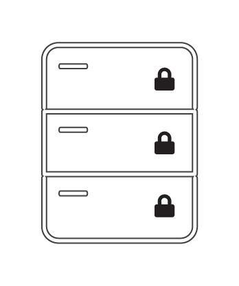

# Cross-Chain Atomic Swaps

```post-author
Matthew Zipkin
```

```post-description
Using the bcoin and bcash libraries, execute a swap of coins between two users
on two chains. Create a Hash Time-Locked Contract to perform the swap securely.
```

## What are cross-chain atomic swaps?

A cross-chain atomic swap is a type of crypto-currency exchange. Like trading dollars for pesos,
it's a process in which two people can exchange one crypto-currency for another, but without trusting
each other. We say the swaps are "atomic" because they must be all-or-nothing. To protect both users,
there must be no scenario in which one person can control both coins at the same time.

Atomic swaps can be executed on many blockchains, but not all. In this guide we'll
be focusing on just Bitcoin and Bitcoin Cash, using the [bcoin](https://github.com/bcoin-org/bcoin)
and [bcash](https://github.com/bcoin-org/bcash) libraries respectively. It's a bit of
a game: the rules can't be broken, but you still have to pay attention. The magic
machine that allows the atomic swap is called a Hash Time-Locked Contract, or HTLC.

## HTLCs

Blockchains are like a stack of locked mailboxes with deposit slots. When you want to receive Bitcoin
from someone, you tell them which mailbox to put the coin into.



Bob decides to pay Alice. He puts 0.5 BTC in the slot of Mailbox “A” which is locked by Lock “A”. When
Alice is ready to spend the coin or move it somewhere else, she uses her Key “A” to open the lock and
take out the coin.


HTLCs are more complicated. First of all, they have TWO locks, and EITHER lock can open the mailbox and
expose the coin. They also use much fancier locks than usual.


### TIME LOCKS

Time locks still require the right key but they ALSO require a certain amount of time to pass. Even if
you have the key for this lock, you still need to wait until the time “expires” before you can open it.

### HASH LOCKS

Hash locks require the right key but they ALSO require a SECRET CODE to be entered, like the PIN on an ATM.
Even if you have the key for this lock, you also need to enter the right code to open it. When you enter
the secret code, it is visible for the entire world to see, like the screen on a calculator.

## Let's swap!

For now we’ll ignore the time locks, but just keep in mind they are there. In an ideal situation, only
the hash locks are used anyway. Let’s say Alice wants Bitcoin and Bob wants Bitcoin Cash. They agree to
swap the coins they have for the coins they want.

Alice makes two hash locks, that both require the EXACT SAME secret code. However, one requires her Key “A”
but the other requires Bob’s Key “B”. Alice knows the secret code but keeps it a secret for now.


Alice puts Hash Lock “A” on a Bitcoin mailbox, and Hash Lock “B” on a Bitcoin Cash mailbox. Alice deposits
her Bitcoin Cash into Mailbox “B” and Bob deposits his Bitcoin into Mailbox “A”. 


### MAGIC TIME!

Once the coins are both deposited, Alice goes over to Bitcoin Mailbox “A”. She puts in her Key “A” and
enters the secret code she came up with earlier. With the key and the code entered, the mailbox is
opened and she can acquire the Bitcoin. Meanwhile, Bob is watching Bitcoin Mailbox “A” and SEES ALICE ENTER
HER SECRET CODE. Now Bob knows the code too! He goes over to Bitcoin Cash Mailbox “B”, puts in his Key “B”
and enters the secret code he JUST LEARNED from watching Alice. Voila! Bob opens Bitcoin Cash Mailbox “B”
and the coin is his. Alice and Bob have just successfully swapped coins on two separate blockchains without
ever trusting each other or any third-party.


### But what if things don’t go according to plan?

Let’s say Bob put his Bitcoin into Mailbox “A” but then never heard from Alice again. If she doesn’t enter
her secret code, Bob can’t get the Bitcoin Cash he wanted. Bob needs a way to get his original Bitcoin BACK
if Alice doesn’t participate. This is where the time locks come in.

The time locks allow both parties to refund themselves in case the swap does not succeed as planned. The
reason we use time locks for this is to eliminate the possibility that one person ends up with both coins,
leaving the other person with nothing. When the locks are put on the HTLC mailboxes, the time locks are set
to give each counterparty a chance to redeem the swap without interference. If the swap never happens,
everyone can take back the coins they started with after the time expires.


The length of time on each lock is important to ensure that the game can only be played fairly. In our story,
Alice’s time lock should be longer (say like a week) and Bob’s lock should be much shorter (like a day).
Broadly speaking this is because Alice knows the hash lock secret and therefore has a major advantage. The
game doesn’t really begin until she reveals her secret code so we make her refund much more cumbersome. If
Bob thinks Alice is going to flake out, he can refund his Bitcoin from Mailbox “A” long before Alice can
refund her Bitcoin Cash from Mailbox “B”. 

Think about the counter-example. If Mailbox “B” had the shorter refund time, Alice could wait until that time
expires, refund herself the Bitcoin Cash from Mailbox “B” AND THEN ALSO enter the secret code into Bitcoin
Mailbox “A” and take the Bitcoin that Bob sent. Alice would have all the money and Bob would be broke!

## Output scripts

This is the output script of an HTLC written in Bitcoin Script (or Bitcoin Cash Script?):

```bash
OP_IF
  OP_SHA256
  <hash>
  OP_EQUALVERIFY
  <pubKey1>
  OP_CHECKSIG
OP_ELSE
  <locktime>
  OP_CHECKSEQUENCEVERIFY
  OP_DROP
  <pubKey2>
  OP_CHECKSIG
OP_ENDIF
```


