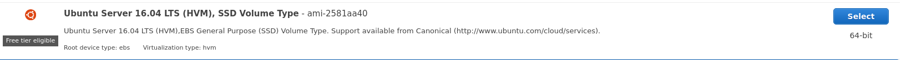

# Full Node VPS Setup

```post-author
Alex Sherbuck
```

```post-description
This guide provides installation instructions for a Bcoin full node running on a Digital Ocean of Amazon AWS Virtual Private Server.
```


* [Introduction](#introduction)
* [Digital Ocean](#digital-ocean)
* [Amazon AWS](#amazon-aws)
* [Connecting to your server](#connecting-to-your-server)
* [Setting up the environment](#setting-up-the-environment)
* [Create a New User](#create-a-new-user)
* [Install Bcoin](#install-bcoin)


## Introduction

Running a full node requires your computer always be online and connected to the Bitcoin network. For most users, a VPS is an elegant 24/7 full node solution.

## Digital Ocean

### Create an account @digitalocean.com
### Choose 'Create' -> 'Droplet' from the account dashboard


### Choose 'Ubuntu 16.04' for OS Distribution


### Choose '4 GB 2 CPU $20/month' for Droplet Size

### Add Block Storage, 500GB $50/month.

### Choose a data center region.


##### A Note on hardware requirements
These hardware requirements are for a full node. When run in SPV mode, you will not need the additional block storage. To run a full node you must maintain a complete history of all Bitcoin transactions. Without the full history the node is unable to validate transactions. If it cannot validate transactions, it cannot validate blocks or mine transactions to blocks.

SPV Nodes use something called a bloom filter to maintain a smaller set of records. For example, if your Bitcoin address were `1A1zP1eP5QGefi2DMPTfTL5SLmv7DivfNa` your SPV node will ask its network peers for all transactions with an address that starts with `1A1z`. The returned data set will contain extra transactions irrelevant to your wallet. But its storage requirements will be far smaller than a full node. Consequently, SPV Nodes can only verify their own transactions.

More information on SPV Nodes:
+ [Bitcoin Whitepaper - Section 8](https://bitcoin.org/bitcoin.pdf)
+ [Bitcoin.org Developer Guide](https://bitcoin.org/en/developer-guide#simplified-payment-verification-spv)
+ [BIP37](https://github.com/bitcoin/bips/blob/master/bip-0037.mediawiki)

### Add a new ssh key


### Setting Up SSH
If you already have an ssh key you can copy your pubkey here. If you do not then follow these steps:

```
ssh-keygen -t rsa -C "your_email@example.com"
```

Accept the defaults.

On Windows your keys are located:

```
%userprofile%/.ssh
```

On Linux/Mac:

```
cd ~/.ssh
```

Copy the contents of the `id_rsa.pub` file and paste them into Digital Ocean's form.

```
ssh-rsa AAAAB3NzaC1yc2EAAAADAQABAAABAQCsYKEA5LZCDyMF+ZbrPWeVIYso0ZzpIZx9L7R+CGqMPo0mrSlYeeaPbP1btM/Wis4a81EaTM7Y5kkKqZ4XB/LnRWp415XVl5QdtGF2l5tgiy2ootVxEwdrH0lXyGFHEpOwHU6MYdYCd+bgpQwa291Q4bOUJhGxNZ07L/rMtZfWhWL
+YL+JpSajg/uonu+4YKuFETggGLIuK+piTD9dvjiaThwKtqiCh2dnqdHztRYk+OehJUcof3tFl9kSRUmh9MVI7pDaOxCJWRaU1dsn9YaUwRkIyOwESHqBdCE9ZDU4FzNItRh2dYY4ukGv2iRqZoTrjcB8UGJepI65aINKNvdj email@nomail.com
```

8. Choose a hostname for the droplet and click create.

Digital Ocean will provision your server. Now is a good time to grab coffee.


## Amazon AWS

### Create an account
[AWS](https://aws.amazon.com)

### Launch a new instance from the console
[Console](https://aws.amazon.com/console)

</img><br>
### Choose 'Ubuntu 18.04' (or latest) and at least 2CPU 4GiB for hardware

### Continue to add storage. Add 500GiB

### Review and Launch
### Amazon will prompt you for an ssh keypair, download a new keypair


Treat this keyfile with the same respect you treat your Bitcoin wallet file. Both are private keys and you will be the only person with a copy of your keyfile. If you lose it, Amazon will not be able to recovery it for you.

### Accept Acknowledgement & Launch Instances
### View Instances


[A Note on Hardware Requirements](#a-note-on-hardware-requirements)

Amazon will provision your server. Now is a good time to grab coffee.


## Connecting to your server

#### Digital Ocean

```
ssh username@Your.Server.Ip.Here
```

E.g.

```
ssh username@178.62.124.90
```

On a Linux/Mac if you don't provide a username it will use the currently logged in user. If you setup ssh keys you will not need to provide a username or password. You can also edit `/etc/hosts` to add a line like so:

```
178.62.124.90    fullnode
```

And then you can use:

```
$ ssh fullnode
```

to login without a username, password or having to remember the server ip.

Accept the RSA key, and you will be at the command line


#### Amazon

In the same directory as the private key you downloaded,

``` bash
chmod 400 test.pem
ssh -i "test.pem" yourname@yourinstance.amazonaws.com
```

E.g.

```
ssh -i "test.pem" ubuntu@ec2-18-219-26-103.us-east-2.compute.amazonaws.com
```

Accept the RSA key, and you will be at the command line

```
ubuntu@ip-172-31-7-194:~$
```

## Setting up the environment
The VPS is setup, from here the intructions will be the same regardless of VPS provider.

1. Install NVM
2. Install Node
4. Install build essential
5. Install python

_Note_: The install command for `nvm` may change over time. Check the official
repo for `nvm` before proceeding: https://github.com/nvm-sh/nvm. The nodejs
`LTS` version may change over time as well. At this time, bcoin
requires nodejs version 10.0 or greater. The current LTS is 12.14.0, which can
be checked at https://nodejs.org/en/.

```
$ curl -o- https://raw.githubusercontent.com/nvm-sh/nvm/v0.35.2/install.sh | bash
$ source ~/.bashrc
$ nvm install --lts
$ sudo apt-get update
$ sudo apt-get install build-essential python
```

## Install Bcoin

Depending on your server's default software package, you may also need to [install `git`](https://git-scm.com/book/en/v2/Getting-Started-Installing-Git).


```
$ git clone https://github.com/bcoin-org/bcoin
$ cd bcoin
$ npm install -g
```

### Command Line Interaction
After bcoin installs we're going to store some configuration info and sensitive data as environmental variables.

```
$ export BCOIN_API_KEY=hunter2
$ export BCOIN_NETWORK=main
$ bcoin --index-tx --index-address --daemon
```

Alternatively, you can assign http port and network using command line flags when you launch:

```
$ bcoin --index-tx --index-address --http-port=8332 --network=main
```

...or insert them in a configuration file at `~/.bcoin/bcoin.conf`:

```
network: main
api-key: hunter2
index-tx: true
index-address: true
```

Learn more about the config options [in the docs.](https://github.com/bcoin-org/bcoin/blob/master/docs/configuration.md)

You can use the bcoin CLI tool out of the box, it is installed globally along with
the full node.

To view your node's status:

```
$ bcoin-cli info --api-key=hunter2
{
  "version": "2.0.0-dev",
  "network": "main",
  "chain": {
    "height": 0,
    "tip": "000000000019d6689c085ae165831e934ff763ae46a2a6c172b3f1b60a8ce26f",
    "progress": 0
  },
  "indexes": {
    "addr": {
      "enabled": true,
      "height": 0
    },
    "tx": {
      "enabled": true,
      "height": 0
    },
    "filter": {
      "enabled": false,
      "height": 0
    }
  },
  "pool": {
    "host": "112.69.132.10",
    "port": 8333,
    "agent": "/bcoin:2.0.0-dev/",
    "services": "1001",
    "outbound": 3,
    "inbound": 0
  },
  "mempool": {
    "tx": 0,
    "size": 0,
    "orphans": 0
  },
  "time": {
    "uptime": 6,
    "system": 1577238664,
    "adjusted": 1577238664,
    "offset": 0
  },
  "memory": {
    "total": 67,
    "jsHeap": 11,
    "jsHeapTotal": 29,
    "nativeHeap": 37,
    "external": 14
  }
}
```

For a complete list of CLI commands, check the [API documentation](https://bcoin.io/api-docs/index.html). The CLI supports node, wallet and has full RPC functionality.

Stop your node with:

```
bcoin-cli rpc stop
```

Watch your node's debug log with:

```
tail -f ~/.bcoin/debug.log 
```
