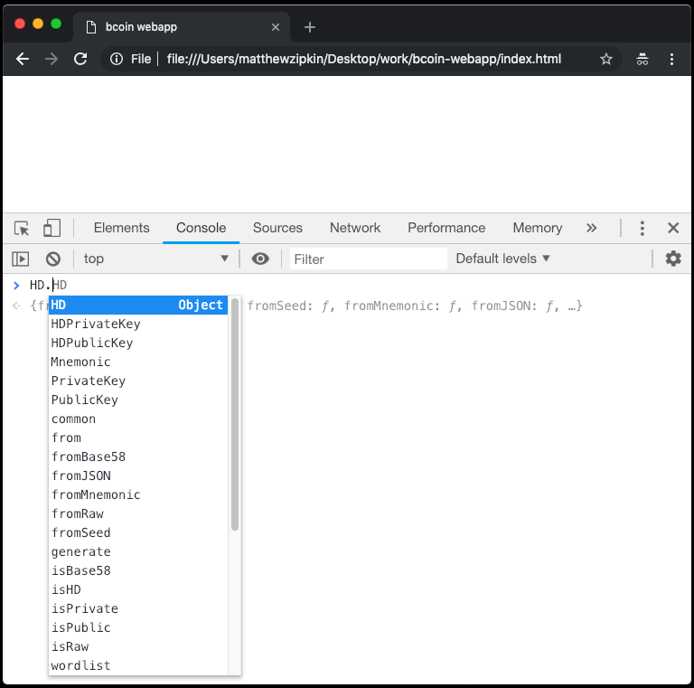

# Building web applications with the bcoin library

```post-author
Matthew Zipkin
```

```post-description
Use individual modules from the bcoin library to build web applications.
```

bcoin is an awesome full node implementation, built in such a way that
each of its modules can be pulled out and reassembled in any configuration, or
run totally independently from any kind of node, wallet, or network. The developers
are also committed to maintaining browser compatibility in every module, even
adding alternative scripts for components like [databases](https://github.com/bcoin-org/bdb/blob/master/lib/level-browser.js)
and [cryptography](https://github.com/bcoin-org/bcrypto/blob/master/lib/js/sha256.js)
so every bcoin function will run properly in the browser. In a previous guide, we
illustrated [how to run a full node in the web browser](https://bcoin.io/guides/browser).
While that is an amusing novelty and intriguing proof-of-concept, its actual utility is
limited by the security and efficiency of the platform. But because bcoin was developed
with a modular architecture, we can build very useful web-based applications for Bitcoin
using small bits of the code base, and only importing what we need.

## Let's build a Bitcoin web-app

For this guide, we're going to build a simple website that turns
["xpub" Extended Public Keys](https://github.com/bitcoin/bips/blob/master/bip-0032.mediawiki#Extended_keys)
into [hierarchical-deterministic wallet accounts](https://github.com/bitcoin/bips/blob/master/bip-0044.mediawiki),
and outputs both legacy and
[SegWit addresses.](https://github.com/bitcoin/bips/blob/master/bip-0173.mediawiki)

You can play with the finished app at [https://bcoin.io/apps/address](https://bcoin.io/apps/address/index.html).

## Install the bcoin library

Nothing special here, this is how all bcoin projects start. If you already have
bcoin installed somewhere, you don't have to do this again.

```
git clone https://github.com/bcoin-org/bcoin
cd bcoin
npm install
```

## Install the browser-bundling tools.

There are a few popular tools out there that convert nodejs-style JavaScript for
browser compatibility. You might have already heard of [browserify](https://www.npmjs.com/package/browserify)
or [webpack](https://www.npmjs.com/package/webpack) but for this guide we are going
to use [bpkg](https://www.npmjs.com/package/bpkg). `bpkg` was created by the bcoin
developers in order to get the minimum functionality we need WITH ZERO DEPENDENCIES.
This a monumental boon for security, especially when developing applications for cryptocurrency.
Let's install it globally so we can just run it from the command line in any directory:

```
npm install -g bpkg
```

There is one other package we can install as an option and that is [uglify-es.](https://www.npmjs.com/package/uglify-es)
This package [minifies](https://en.wikipedia.org/wiki/Minification_%28programming%29)
the code after it has been converted, to save an immense amount of space in the
final JavaScript files. For this project, `uglify-es` will save us about 40% of
the final file size! Keep in mind, this is a compromise of security for convenience.
Until the bcoin development team re-implements `uglify-es`, we have to trust that
it won't inject vulnerabilities into our code. For the purposes of this guide, we
are going to accept that risk ;-)

```
npm install -g uglify-es
```

## Compile a bcoin module for the browser

In bcoin, mnemonic seeds, HD derivation, and private keys are all handled by the
[hd module](https://github.com/bcoin-org/bcoin/tree/master/lib/hd). Here's the commands
to compile the hd module for our web-app:

```
mkdir <new dir for your app>
cd <wherever your bcoin repo is installed>
bpkg --browser --standalone --plugin [ uglify-es --toplevel ] --name HD \
--output <your new app dir>/HD.js lib/hd/index.js
```

Here's a rundown of those `bpkg` command options:

`browser` Sets the environment for the browser instead of nodejs.

`standalone` Enforces universal compatibility, allowing us to access the module
from the global scope.

`plugin` Runs our code through the minifier, explained above.

`name` This is the name of the global object created by our output.

`output` Destination for final output file.

`lib/hd/index.js` Finally, we add the target entry-point for the process.

## Initialize our webpage

Next we'll create the simplest-possible html file and import the module we just compiled.
Create this file in the same directory that `HD.js` was exported to.

`index.html`:
```html
<!DOCTYPE html>
<html>
  <head>
    <title>bcoin webapp</title>
  </head>
  <body>
    <!-- Input elements and text will go here -->
    <script type="text/javascript" src="HD.js"></script>
    <script type="text/javascript">
      // Additional JavaScript code will go here
    </script>
  </body>
</html> 
```

If you open this file in a web browser, you'll see blank page, but the JavaScript
module is loaded in there! Open up the developer console and just start typing `HD.`
In browsers like Chrome, the console will reveal to you all the methods and properties
of the `HD` object. Right away, we can see a list of awesome things we can do with
this module!

<div style='text-align: center'>
   
 </div>

## Create an HD object from a user's xpub

Let's add a text-input field to the webpage for the user to type in a xpub string:

```html
<label for='xpub'>Extended public key: </label>
<input id='xpub' oninput='parseXpub()'>
<div id='xpub-check'></div>
```

You can add some CSS here too but the really important bit is `oninput=parseXpub()`.
This is telling the page to call a JavaScript function every time anything is typed or
changed in the text field. We'll write that function next and insert it after the `<script>`
tag in the HTML page. The first thing we want to do is parse the user's input and
return an error if the key isn't valid -- bcoin will take care of all the hard work!
Creating a bcoin `HD` object from a base58-encoded xpub is simple, we'll just wrap it
in a decent user experience:

```javascript
function parseXpub() {
  const string = document.getElementById('xpub').value;
  let xpub;
  try {

    // attempt to create an HD object from the input string
    xpub = HD.fromBase58(string);

  } catch (e) {

    // if the string is malformed, an error will be thrown
    document.getElementById('xpub-check').innerHTML = `Bad xpub: ${e.message}`;
    return false;

  }
  document.getElementById('xpub-check').innerHTML = `xpub OK`;
}
```

At this point you can already paste an xpub string into the text field, and it will display
an error if the key is not complete and valid. You can try changing one character and see the
error detection. For testing purposes, you can use
[this example xpub from the BIP32 spec](https://github.com/bitcoin/bips/blob/master/bip-0032.mediawiki#Test_Vectors):

`xpub6D4BDPcP2GT577Vvch3R8wDkScZWzQzMMUm3PWbmWvVJrZwQY4VUNgqFJPMM3No2dFDFGTsxxpG5uJh7n7epu4trkrX7x7DogT5Uv6fcLW5`

## Extract the metadata encoded by the key

Extended Public Keys are packed with details about how they were derived. We'll
pull some of that information out and display it to the user. We can tell right
away by the string's prefix what network it is for. In bcoin, key prefixes are defined
by each network in the
[protocol/networks.js](https://github.com/bcoin-org/bcoin/blob/master/lib/protocol/networks.js)
file. The xpub also tells us how far down the derivation tree it is, and at what index.
In BIP44 paths, the index is a "hardened" key often referred to as the "account index".
Simply by instantiating an `HD` object, bcoin has already extracted those properties.

Let's print out those data to a new `div` in the webpage.
Add some more lines to the `parseXpub()` function started already:

```javascript
function parseXpub() {
  ...

  // derive network from first letter of string
  const names = {
    x: 'main',
    t: 'testnet',
    r: 'regtest',
    s: 'simnet'
  };
  const network = names[string[0]];

  // get all other metadata imported by bcoin
  const depth = xpub.depth;
  const childIndex = xpub.childIndex;
  const hard = childIndex >= HD.common.HARDENED;
  const account = hard ? (childIndex - HD.common.HARDENED) : childIndex;

  // compose output and insert into html
  let explain = '';
  explain += `Network: ${network}<br>`;
  explain += `Depth: ${depth}<br>`;
  explain += `Child Index: ${account + (hard ? "'" : '')}<br>`;
  document.getElementById('explain').innerHTML = explain;
}
```

Then somewhere in the body of the html document, add a target for the output:

```html
<div id='explain'></div>
```

## Derive child keys from the BIP32 path

Now that we have a master public key, we can generate an (almost) infinite number
of Bitcoin addresses. The bcoin wallet is designed to follow 
[BIP44](https://github.com/bitcoin/bips/blob/master/bip-0044.mediawiki) which
specifies a series of derivations and a function for each level. It's a standard
path that many Bitcoin wallets follow with a hardened account index, a "soft" branch
index to specify receive or change, and finally an incremented index for addresses.
For the purposes of this guide, we'll assume only BIP44 xpubs are being entered,
and allow the user to derive these typical addresses.

For testing this, let's use a BIP44-based xpub example:

`tpubDC5FSnBiZDMmhiuCmWAYsLwgLYrrT9rAqvTySfuCCrgsWz8wxMXUS9Tb9iVMvcRbvFcAHGkMD5Kx8koh4GquNGNTfohfk7pgjhaPCdXpoba`

We'll get a user-input path with defaults set to `receive` address (as opposed to `change`)
and address index `0`. Notice again how we call the whole chain of derivation functions
any time a value is changed with the attribute `onchange='parseXpub()'`.

```html
<div>
  Derivation path:
  <input type='number' onchange='parseXpub()' id='branch' min='0' value='0'>/
  <input type='number' onchange='parseXpub()' id='index' min='0' value='0'>
</div>
```

In bcoin, traversing the HD path of keys is a recursive process, so once we get the
user input, it's a pretty simple chain to get the key we want. The second parameter
we're passing here to each `derive()` call is a boolean that represents `hardened`
derivation. Learn more about that
[here](https://bitcoin.stackexchange.com/questions/37488/eli5-whats-the-difference-between-a-child-key-and-a-hardened-child-key-in-bip3)
and [here](https://bitcoin.stackexchange.com/questions/37826/best-practices-for-hardened-keys-in-hd-wallets).

Continue the `parseXpub()` function as follows:

```javascript
function parseXpub() {
  ...

  // gather the value of all the input fields
  const branch = parseInt(document.getElementById('branch').value);
  const index = parseInt(document.getElementById('index').value);

  // derive a key from a key from the master :-)
  const key = xpub.derive(branch, false).derive(index, false);
}
```

## Derive address from key

Now that we can import a master public key and generate any child key the user wants, we
need to derive from that key a usable Bitcoin address. This is actually a function
the bcoin `HD` module can _not_ do. So we'll need to import just one more tiny bit
of the bcoin library: `KeyRing`.

With `bpkg`, exporting modules from bcoin is a cinch:

```
cd <wherever your bcoin repo is installed>
bpkg --browser --standalone --plugin [ uglify-es --toplevel ] --name KeyRing \
--output <your app dir>/KeyRing.js lib/primitives/keyring.js
```

Add the new `keyring` module to your webapp:

```html
<script type='text/javascript' src='KeyRing.js'></script>
```

Now we can access the `KeyRing` module, create `KeyRing` objects from public keys,
and get the addresses. We'll actually make two `KeyRing`'s so we can derive both legacy
and SegWit addresses. First, add a `<div>` for the output to fill in:

```html
<div id='address'></div>
```

Then add this code to the end of the `parseXpub()` function:

```javascript
function parseXpub() {
  ...

  // create a KeyRing object from the derived public key
  const ringLegacy = KeyRing.fromPublic(key.publicKey);

  // set witness to false for legacy address
  ringLegacy.witness = false;

  // get the address in base58 format for this network
  const legAddr = ringLegacy.getAddress('base58', network);

  // do it all again but this time with witness enabled
  const ringWitness = KeyRing.fromPublic(key.publicKey);
  ringWitness.witness = true;
  const witAddr = ringWitness.getAddress('string', network);
    
  // print the output in to the HTML elements
  let addrInfo = '';
  addrInfo += `Legacy address: ${legAddr}<br>`;
  addrInfo += `SegWit address: ${witAddr}`;
  document.getElementById('address').innerHTML = addrInfo;
}
```

I added some bells and whistles to the final version. [You can review the source code
here.](https://github.com/bcoin-org/bcoin-org.github.io/blob/staging/apps/address/index.html)

## A word about security

Web browsers are inherently dangerous environments. Browser plugins can modify any
content or
[JavaScript function on the page](https://github.com/w3c/webcrypto/issues/107),
and web sites are easy vectors for
phishing attacks. Tools like ours are nice because they can work on almost any
platform, or be imported into an [Electron](https://electronjs.org/) app or
[Cordova](https://cordova.apache.org/) app, where the environment can be better
secured. Verify whatever source code you can, only run trusted software, and use
offline machines whenever possible for these types of calculations!

## What's next

bcoin has a JavaScript module for every Bitcoin function you can think of: keys,
transactions, blocks, wallets, output scripts...! There's a lot you can do without
running any kind of node. The simplicity of bcoin means you can create stand-alone
web applications and run them online or offline.
[Sign transactions](https://github.com/bcoin-org/bcoin/blob/master/lib/primitives/mtx.js#L1038)
on an air-gapped computer, or use the
[script parser](https://github.com/bcoin-org/bcoin/blob/master/lib/script/script.js)
to test complicated smart contracts.

You can even connect to an actual running full or SPV node!
[bcoin has an HTTP API](https://bcoin.io/api-docs) which you could link to from your
webapp. You could even use `bpkg` to bundle a
[complete node and wallet client](https://github.com/bcoin-org/bclient) and connect
to your bcoin node via websockets!

Whatever you build, be sure to let us know! We want to hear from you on
[Twitter](https://twitter.com/Bcoin), [GitHub](https://github.com/bcoin-org/bcoin)
or [Slack](http://bcoin.io/slack-signup.html).


